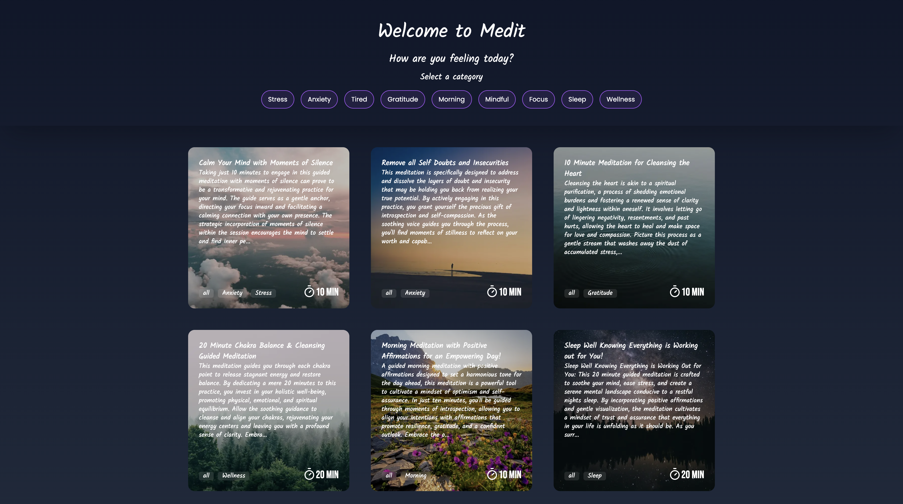

# Medit

Medit is an audio-guided meditation application that allows users to explore and listen to a variety of meditation sessions categorized by themes. Whether you're a beginner or an experienced meditator, Medit provides a peaceful and organized way to enhance your mindfulness practice.




## Features

- **Audio Guided Meditations**: Listen to high-quality guided meditations led by experienced instructors.
- **Category Selection**: Browse meditations by various categories such as relaxation, stress relief, focus, sleep, and more.
- **User-Friendly Interface**: An intuitive design that makes finding and listening to meditations easy and enjoyable.

## Demo

[https://medit-omega.vercel.app](https://medit-omega.vercel.app)

## Installation

Clone the repository:

```bash
git clone https://github.com/piyush-rawat/medit.git
```

Navigate to the project directory

```bash
cd medit
```

Install the dependencies

```bash
npm install
```

Run the project

```bash
npm run dev
```

## Usage

1. Navigate through the categories to find a meditation that suits your needs.
2. Click on a meditation to start listening.

## Technologies and Frameworks Used

- Next.js
- Tailwindcss
- Framer Motion
